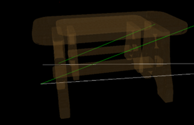

# 3d-software-engine
A simple software rasterizer and 3d modeller, made as a school project using Windows Presentation Foundation

This supports loading in .obj files and transforming them (translation, rotation and scale) as well as copy-pasting models. Groups of models can be saved and loaded from file

All the main code was written in one file (and in hindsight, it should've been spread out into different files)

Demo images: 

